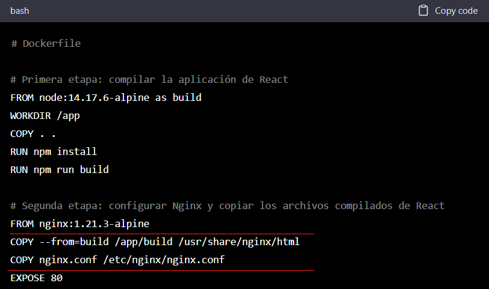

### Solucionar un bug en container.

> Descripción del problema: Actualmente existe un bug en el container image del frontend. Lo que sucede es que al momento de cargar una URL especifica se obtiene un error 404. 

Solución: En la segunda etapa, estamos utilizando una imagen de Nginx para servir la aplicación de React. Copiamos los archivos compilados de React desde la primera etapa en el directorio /usr/share/nginx/html, lo que nos falta es copiar el archivo de configuración de Nginx nginx.conf en /etc/nginx/ y finalmente exponer el puerto 80.

A continuacion se mostrara un ejemplo:

